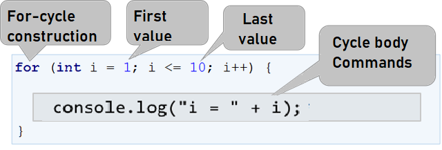

 ### Loops 
Objectives

In this lesson, we will introduce the repeat blocks of commands, also known as "loops". We will write a set of loops, using the for operator in its simplest form. Finally, we will solve a few practical problems that require repetition of commands, using loops.

In programming, we often need to execute a block of commands multiple times. To do that we use **loops**. Let's look at the example of a **`for`** loop, which will loop through the numbers from 1 to 10 and print each one:

```js
for (let i = 1; i <= 10; i++) {
    console.log("i = " + i);
}
```

👉 The loop starts with the operator **`for`** and loops through all values of a given variable in a given range, for example, all numbers from 1 to 10 included. For each value, it executes a sequence of commands.

Upon declaring the loop you can specify a start value and an end value. The loop's body is usually in curly braces `{ }`and contains one or more commands. 

👇 The structure of a **for** loop:


`ì++` is the step. 

A for loop often circles 1 to n times (for example 1 to 10). The goal is to loop through the numbers 1, 2, 3, …, n sequentially and after each pass through the loop to perform a certain action. 
👉 In the example above the variable `i` holds values from `1` to `10` and the current value is printed in the loop's body. The loop repeats 10 times and each of these repetitions is called an **"iteration"**.

✋ Let's put Hands on practice. 💻

#### Task One: The numbers from `1 to 100`

 ✍️ Write a program that prints the numbers from 1 to 100. The program does not accept input and prints the numbers from 1 to 100 sequentially, each on a separate line.

#### Task Two: All Numbers ending in 7

 ✍️ Write a program that finds all numbers ending in 7 in the range [1 … 1000]. 

### Task Three:  All Latin Letters

Write a program that prints the letters from the alphabet: a, b, c, …, z.